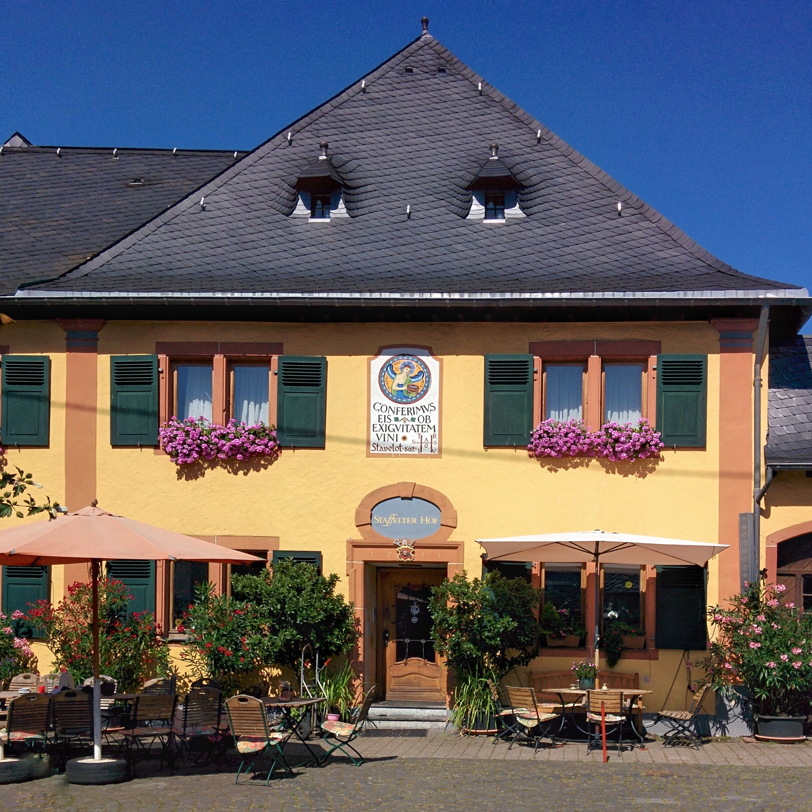

# What and Where are the World's Oldest Businesses

## Project Description

Welcome to the **What and Where are the World's Oldest Businesses** project! 🌍🏢

In the dynamic world of business, longevity is a testament to adaptability and strategic planning. Some businesses defy time and flourish for centuries. In this project, we delve into data from BusinessFinancing.co.uk to uncover the world's oldest businesses. We'll unearth their founding dates and industries they belong to, shedding light on their enduring success.

This exploration takes us through multiple datasets, reminiscent of real-world business scenarios. To unravel the stories of these ancient businesses, we'll leverage joining techniques to consolidate data sources. Armed with manipulation tools like grouping and filtering, we'll unravel insights about these remarkable establishments.
